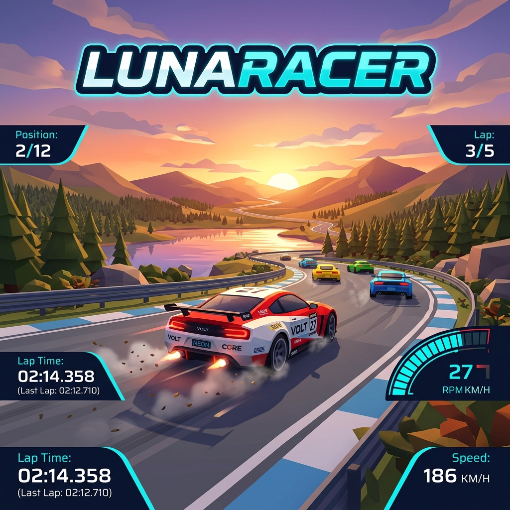

<p align="center">
  
</p>

<h1 align="center">🏎️ LunaRacer</h1>

<p align="center">
  <strong>Jogo de corrida arcade 3D direto no navegador</strong><br>
  HTML · JavaScript · CSS · Three.js r180
</p>

<p align="center">
  <a href="#-como-jogar">Como Jogar</a> ·
  <a href="#-funcionalidades">Funcionalidades</a> ·
  <a href="#-pistas-disponíveis">Pistas</a> ·
  <a href="#-arquitetura">Arquitetura</a> ·
  <a href="#-como-executar">Executar</a> ·
  <a href="#-testes">Testes</a> ·
  <a href="#-licença">Licença</a>
</p>

---

## 📖 Sobre

**LunaRacer** é um jogo de corrida arcade 3D que roda inteiramente no navegador, sem necessidade de instalação. Construído com **Three.js r180** (via CDN), oferece uma experiência imersiva com:

- **16 carros** competindo simultaneamente (jogador + 15 adversários com IA)
- **5 circuitos** autorais inspirados em pistas reais
- **Física arcade** com modelo de veículo detalhado (aceleração, frenagem, grip lateral, arrasto aerodinâmico)
- **Áudio procedural** com motor, pneus e efeitos sonoros via Web Audio API
- **HUD completo** estilo F1 com posição, cronômetro regressivo, velocímetro, minimapa e tempos de volta
- Interface totalmente em **Português do Brasil**

---

## 🎮 Como Jogar

### Teclado

| Tecla | Ação |
|:-----:|:-----|
| `W` / `↑` | Acelerar |
| `S` / `↓` | Frear / Ré |
| `A` / `←` | Virar à esquerda |
| `D` / `→` | Virar à direita |
| `C` | Alternar câmera |
| `Esc` | Pausar corrida |
| `F2` | Painel de diagnóstico |

### Gamepad

Compatível com a **Gamepad API** do navegador. Gamepads com mapeamento `standard` funcionam automaticamente. Mapeamento customizável via código.

| Controle | Ação |
|:--------:|:-----|
| Analógico esquerdo | Direção |
| Gatilho R2 / Botão 7 | Acelerar |
| Gatilho L2 / Botão 6 | Frear |
| D-Pad ← → | Direção alternativa |
| Botão Y / 3 | Alternar câmera |
| Start / Botão 9 | Pausar |

### Câmeras

| Modo | Descrição |
|:----:|:----------|
| Traseira Próxima | Câmera de perseguição padrão |
| Cockpit | Visão interna em primeira pessoa |
| Traseira Longe | Câmera distante com campo de visão maior |
| Panorâmica | Visão ortográfica elevada |

---

## ✨ Funcionalidades

### Corrida
- ⏱️ **Cronômetro regressivo** com extensão de tempo ao cruzar checkpoints
- 🏁 **3 voltas** por corrida com contagem de checkpoints por setor
- 📊 **Classificação em tempo real** entre os 16 carros
- 🎯 **Melhor volta** persistida em `localStorage`
- 🚦 **Contagem regressiva** sonora antes da largada

### Gráficos
- 🌄 **Cenário completo**: montanhas, lago, árvores, nuvens, arquibancada
- 🛣️ **Pista detalhada**: asfalto texturizado, zebras, curbs vermelho/branco, marcações, linha de largada
- 🚗 **Veículos procedurais detalhados**: 3 perfis de carroceria (Apex, GrandTourer, HyperWedge), 6 liveries, rodas com raios modelados, suspensão, faróis/lanternas
- 🔆 **Iluminação**: hemisférica + direcional com sombras PCF suaves
- ⚙️ **3 perfis gráficos**: Baixo, Médio, Alto (ajuste de sombras, pixel ratio, LOD de cenário)

### Áudio
- 🔊 **Motor procedural**: osciladores sawtooth + triangle com resposta à velocidade e aceleração
- 🛞 **Pneus**: ruído proporcional ao drift lateral
- 🔔 **Efeitos**: checkpoint, countdown, green flag, colisão, bandeira quadriculada

### IA dos Adversários
- 🧠 **15 pilotos IA** com habilidade variável por dificuldade (Fácil / Médio / Difícil)
- 🛣️ **Troca de faixa** inteligente com detecção de tráfego à frente
- 🎯 **Direção por erro de heading** + correção lateral + frenagem em curva

### HUD
- 🗺️ **Minimapa SVG** sincronizado com posição real dos carros na pista
- 🏎️ **Velocímetro** em km/h
- 🏆 **Painel de posição** (X/16) com lista de classificação
- ⏱️ **Tempos**: volta atual, última volta, melhor volta
- 📊 **Painel de resultados** ao final da corrida

---

## 🗺️ Pistas Disponíveis

| # | Pista | Extensão | Setores | Inspiração |
|:-:|:------|:--------:|:-------:|:-----------|
| 1 | **Interlagos** | 4.450 m | 13 | Autódromo de Interlagos (SP) |
| 2 | **Costa Azul** | 3.850 m | 8 | Circuito costeiro ficcional |
| 3 | **Serra Alta** | 4.100 m | 9 | Circuito de montanha com elevação |
| 4 | **Vale Seco** | 3.700 m | 8 | Circuito desértico ficcional |
| 5 | **Porto Ciano** | 3.950 m | 8 | Circuito portuário ficcional |

Cada pista possui perfis de dificuldade independentes que ajustam a velocidade máxima e habilidade da IA.

---

## 🏗️ Arquitetura

O projeto é uma **aplicação client-side pura** — sem bundler, sem framework, sem servidor dedicado. Basta servir os arquivos estáticos.

```
LunaRacer/
├── index.html                  # Página principal + HUD completo
├── styles.css                  # Estilos (canvas fullscreen, HUD, overlays, responsivo)
├── game.js                     # Motor principal: cena 3D, loop, câmera, integração
├── game-logic.mjs              # Máquina de estados da corrida (imutável, pura)
├── game-input.mjs              # Controlador de entrada (teclado + Gamepad API)
├── vehicle-physics.mjs         # Simulação física do veículo (120 Hz fixed step)
├── vehicle-models.mjs          # Factory de carros esportivos procedurais (3D)
├── race-ai.mjs                 # IA dos adversários (direção, faixa, frenagem)
├── racing-audio.mjs            # Motor de áudio procedural (Web Audio API)
├── track-configurations.mjs    # Definições das 5 pistas (Catmull-Rom, setores, checkpoints)
├── *.test.mjs                  # Testes unitários (node:test)
├── package.json                # Scripts de validação e testes
├── docs/                       # Documentação e memória do projeto
│   ├── modelo.png              # Imagem de referência visual
│   └── lunaracer-banner.png    # Banner do README
└── .gitignore                  # Exclusões do repositório
```

### Módulos

| Módulo | Responsabilidade |
|:-------|:-----------------|
| `game-logic.mjs` | Máquina de estados imutável: `ready → countdown → racing → finished/paused`. Checkpoints, voltas, tempos, recorde. |
| `game-input.mjs` | Abstrai teclado e Gamepad API. Deadzone, debounce de ações momentâneas, foco/blur. |
| `vehicle-physics.mjs` | Modelo Ackermann simplificado com step fixo de 1/120s. Aceleração, frenagem, grip, arrasto. |
| `vehicle-models.mjs` | Geometria procedural de carros esportivos com LOD (low/medium/high), 3 perfis de carroceria, 6 liveries, cache de geometria/material. |
| `race-ai.mjs` | Piloto IA: seguir tangente da pista, correção lateral, troca de faixa com detecção de tráfego, frenagem em curvas. |
| `racing-audio.mjs` | Osciladores procedurais para motor, pneus e efeitos. Pause/resume/dispose completo. |
| `track-configurations.mjs` | 5 pistas definidas por waypoints → Catmull-Rom centripetal → 256 pontos equidistantes. Setores automáticos. |

### Stack Técnica

| Camada | Tecnologia |
|:-------|:-----------|
| Renderização 3D | [Three.js r180](https://threejs.org/) via CDN (`jsdelivr`) |
| Áudio | Web Audio API (nativa do navegador) |
| Entrada | Keyboard Events + Gamepad API (nativa) |
| Estilos | CSS puro (sem framework) |
| Testes | `node:test` (nativo do Node.js) |
| Dependências de dev | `@playwright/test`, `pngjs` (somente para QA automatizado) |

---

## 🚀 Como Executar

### Pré-requisitos

- Navegador moderno com suporte a **WebGL** e **ES Modules**
- Conexão com a internet (para carregar Three.js via CDN na primeira execução)

### Servidor Local

Qualquer servidor HTTP estático serve. Exemplos:

**Python:**
```bash
cd LunaRacer
python -m http.server 8080
```

**Node.js (npx):**
```bash
cd LunaRacer
npx serve .
```

**VS Code:**
Instale a extensão **Live Server** e clique em "Go Live".

Depois acesse `http://localhost:8080` (ou a porta indicada) no navegador.

> ⚠️ **Importante**: Abrir `index.html` diretamente como `file://` não funciona por restrições de CORS em módulos ES. Use sempre um servidor HTTP.

### Ajustes no Jogo

No canto inferior da tela inicial:

| Ajuste | Opções |
|:-------|:-------|
| Dificuldade | Fácil · Médio · Difícil |
| Gráficos | Baixo · Médio · Alto |
| Pista | Interlagos · Costa Azul · Serra Alta · Vale Seco · Porto Ciano |

---

## 🧪 Testes

O projeto inclui testes unitários para todos os módulos de lógica, executáveis com Node.js nativo:

```bash
node --test game-logic.test.mjs game-input.test.mjs race-ai.test.mjs vehicle-physics.test.mjs vehicle-models.test.mjs track-configurations.test.mjs racing-audio.test.mjs
```

### Cobertura dos Testes

| Módulo | Arquivo de Teste | Foco |
|:-------|:-----------------|:-----|
| Lógica de corrida | `game-logic.test.mjs` | Estados, checkpoints, voltas, tempos, pausa |
| Entrada | `game-input.test.mjs` | Teclado, gamepad, deadzone, foco/blur |
| Física | `vehicle-physics.test.mjs` | Aceleração, frenagem, ré, curva, superfície |
| IA | `race-ai.test.mjs` | Direção, faixa, tráfego, ranking |
| Veículos | `vehicle-models.test.mjs` | Factory, LOD, perfis, cache, liveries |
| Pistas | `track-configurations.test.mjs` | Geometria, setores, checkpoints, dificuldade |
| Áudio | `racing-audio.test.mjs` | Osciladores, pause, dispose, emit |

### Validação de Sintaxe

```bash
node --check game.js
node --check game-logic.mjs
node --check game-input.mjs
node --check vehicle-physics.mjs
node --check race-ai.mjs
node --check racing-audio.mjs
node --check vehicle-models.mjs
node --check track-configurations.mjs
```

---

## 📱 Responsividade

A interface foi projetada para funcionar em diferentes tamanhos de tela:

- **Desktop**: HUD completo com todos os painéis visíveis
- **Tablet / Landscape**: Layout adaptado, painéis compactados
- **Mobile / Portrait**: Menu e HUD redimensionados, canvas fullscreen

O CSS implementa media queries para viewports a partir de **320px**, com suporte a `safe-area-inset` para dispositivos com notch.

---

## 🔧 Detalhes Técnicos

### Performance

- **Physics step fixo**: 120 Hz (1/120s) para estabilidade física independente do framerate
- **Acumulador de tempo**: compensa variações de frame sem pular frames de física
- **LOD de cenário**: perfil gráfico "Baixo" desativa sombras e filtra árvores por distância
- **Geometria instanciada**: barreiras usam `InstancedMesh` para centenas de segmentos
- **Cache de geometria/material**: `WeakMap` por instância Three.js evita duplicação

### Segurança e Robustez

- **Context lost/restored**: trata perda e restauração do contexto WebGL
- **Validação de entrada**: todos os módulos validam argumentos com `TypeError` / `RangeError`
- **Fallback de veículo**: se `vehicle-models.mjs` falhar, usa geometria procedural simplificada
- **MIME workaround**: carrega módulos via `fetch` + `Blob` para compatibilidade com servidores que servem `.mjs` como `text/plain`

---

## 🤝 Contribuindo

1. Faça um fork do repositório
2. Crie uma branch para sua feature (`git checkout -b feature/minha-feature`)
3. Commit suas alterações (`git commit -m 'Adiciona minha feature'`)
4. Push para a branch (`git push origin feature/minha-feature`)
5. Abra um Pull Request

---

## 📄 Licença

Este projeto está licenciado sob a **MIT License** — veja o arquivo [LICENSE](LICENSE) para detalhes.

---

<p align="center">
  <em>"A linha de chegada é só o começo da próxima volta."</em><br><br>
  Desenvolvido por <strong>Cleber Soares</strong><br>
  📧 <a href="mailto:cas1260@gmail.com">cas1260@gmail.com</a>
</p>
